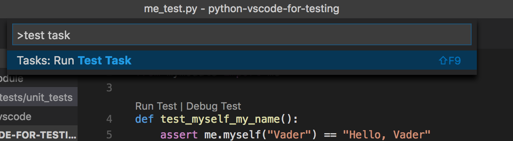
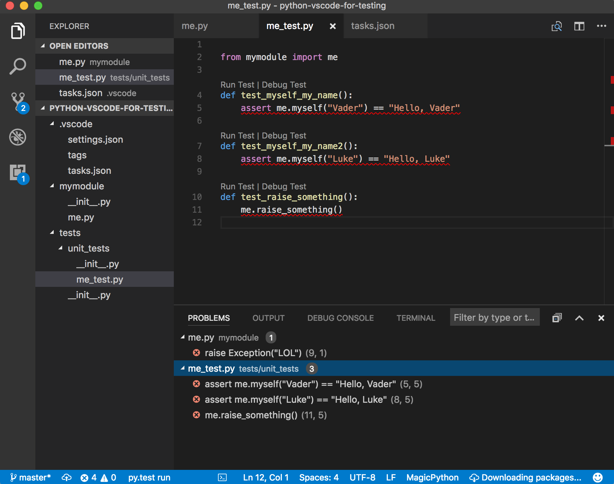
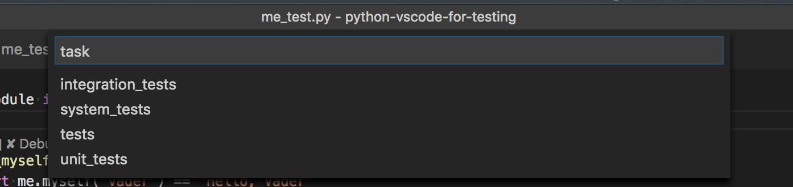

# Configure vscode Test task with pytest

This repository gives a simple example how
to configure the problem matcher for a `Test Task` of
`vscode` in order to get the test failures and other
issues into the `problems view` and highlighted in the `code view`.

See [.vscode/tasks.json](./.vscode/tasks.json) file to see how
`pytest` and problem matchers are configured.

### At project start


### Run Configured Test Task



### See errors in the problem view and code


### Text from the Output view is parsed


# Running only subset of tests
It is a good idea to separate tests into several categories: unit, integration and system tests. They would vary on speed of feedback, focus of the code under test and dependencies.

You can organise different tests types into different subdirectories inside the `tests/` directory. As long as every directory has `__init__.py` file, `pytest` has no issue finding all the tests.
In addition using `-k` option of `pytest` one can just do:
`pytest -k unit_tests` to run only tests from the `unit_tests` directory, as it simply acts as the filter.

As can be seen in [.vscode/tasks.json](./.vscode/tasks.json)
it is possible to create several test tasks.

`vscode` lets you see all the task if you call command menu (osx: "⇧⌘P", win: "Ctrl+Shift+P" linux: "Ctrl+Shift+P") and type `Run Task`, select `Tasks:Run Task` you will see the list of tasks to run. Alternatively from the files menu  (osx: "⌘P", win: "Ctrl+P" linux: "Ctrl+P") just type `task ` (add the space ` ` at then end) and get the same list.



 Ability to run tests frequently as you develop is an amazing productivity boost. Incorporating a keyboard shortcut to run a particular set of tests is very handy. There are set of default tasks: `Run Build Task` and `Run Test Task`. You can assign the shortcuts for these actions. If you have several test tasks then only the first one from the list will be run. At this stage it is not possible to have an acction to re-run the "last" task. There's an open issue for this https://github.com/Microsoft/vscode/issues/25310.

There's a workaround to assign a separate shortcut to each task. It is also discussed in the [issue](https://github.com/Microsoft/vscode/issues/25310).

In your custom keybinding file you can specify an argument passed to each task:
```json
{
    "key": "ctrl+h",
    "command": "workbench.action.tasks.runTask",
    "args": "foo"
}
```

For example in your custom `keybindings.json` file you can have the following shortcuts:
```json
// Place your key bindings in this file to overwrite the defaults
[
    {
        "key": "f9",
        "command": "workbench.action.tasks.test",
        "when": "editorTextFocus"
    },
    {
        "key": "shift+f9 shift+u",
        "command": "workbench.action.tasks.runTask",
        "args": "unit_tests"
    },
    {
        "key": "shift+f9 shift+i",
        "command": "workbench.action.tasks.runTask",
        "args": "integration_tests"
    },
    {
        "key": "shift+f9 shift+s",
        "command": "workbench.action.tasks.runTask",
        "args": "system_tests"
    },
    {
        "key": "shift+cmd+f9",
        "command": "workbench.action.tasks.runTask"
    }
  ]
```

Here we opted to use a sequence `shift+f9` followed by `shift+u` to run the `unit_tests` tasks. The arguments corresponds to the `taskName` in the `tasks.json` file.

# Outstanding issues
> NOTE: file names are not clickable in the Output view.
There's an outstanding issue on https://github.com/Microsoft/vscode/issues/586
"Link to a file position in Output Channel".
It is note immediately obvious that it is the related issue,
but another issue https://github.com/Microsoft/vscode/issues/5583
"Make the error message in the output window clickable to navigate to the error position. " was consolidated into this.

> NOTE: the multi-line problem matcher does not let to capture
a message spread across multiple lines. There's an outstanding issue for this. https://github.com/Microsoft/vscode/issues/9635
"Problem matchers for error messages that span multiple lines #9635"

> NOTE: https://github.com/Microsoft/vscode/issues/25310 to be able to re-run the last used task with a keyboard shortcut.